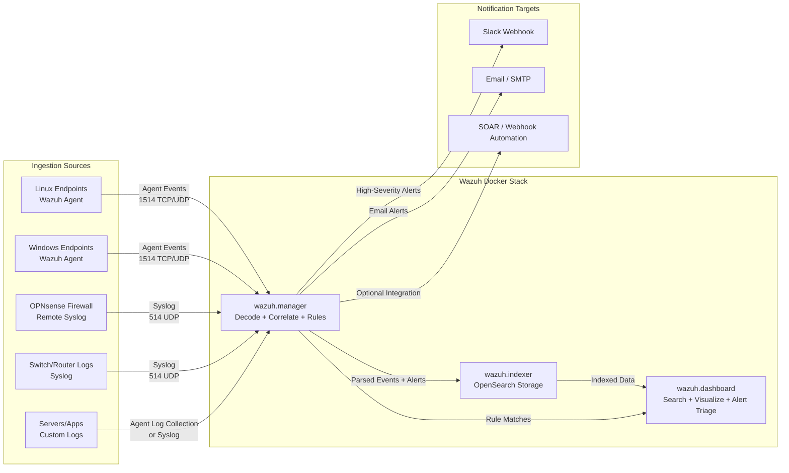

# Wazuh with Docker: Standalone Setup for Agents, Log Aggregation, Alerts, and Notifications

## Overview

This is a standalone Wazuh setup guide using Docker. It is designed for readers who want Wazuh as a dedicated SIEM/log platform whether they run a home lab, a cloud VM, or a small standalone environment.

This walkthrough covers:

- single-node Wazuh deployment with Docker
- Linux and Windows agent enrollment
- centralized log aggregation (agent logs and syslog sources)
- creating custom alert rules
- alert notifications via Slack and email
- operational checks and common troubleshooting

---

## Architecture

Single-node Wazuh Docker deployment:

- `wazuh.manager`: rule engine, decoders, agent manager, API
- `wazuh.indexer`: indexed storage (OpenSearch)
- `wazuh.dashboard`: web interface

Core ports used:

| Port | Protocol | Purpose |
|---|---|---|
| 443 | TCP | Wazuh Dashboard |
| 1514 | TCP/UDP | Agent event channel |
| 1515 | TCP | Agent enrollment/auth |
| 514 | UDP (optional) | Syslog ingestion |

### Ingestion Pipeline Diagram



Data path summary:

- endpoints and network devices feed logs/events into `wazuh.manager`
- manager applies decoders and rule logic, then stores events in `wazuh.indexer`
- `wazuh.dashboard` reads indexed data for search, dashboards, and investigations
- alert integrations (Slack/email/webhook) are triggered from manager rule matches

---

## Prerequisites

Minimum recommended host resources:

- 4 vCPU
- 8 GB RAM (16 GB preferred)
- 80 GB SSD (more if long log retention)
- Ubuntu 22.04/24.04 or Debian-based Linux with Docker support

Install Docker Engine and Compose plugin (official repo preferred):

```bash
sudo apt update
sudo apt install -y ca-certificates curl gnupg
sudo install -m 0755 -d /etc/apt/keyrings
curl -fsSL https://download.docker.com/linux/ubuntu/gpg | \
  sudo gpg --dearmor -o /etc/apt/keyrings/docker.gpg
sudo chmod a+r /etc/apt/keyrings/docker.gpg

echo "deb [arch=$(dpkg --print-architecture) \
  signed-by=/etc/apt/keyrings/docker.gpg] \
  https://download.docker.com/linux/ubuntu \
  $(. /etc/os-release && echo "$VERSION_CODENAME") stable" | \
  sudo tee /etc/apt/sources.list.d/docker.list > /dev/null

sudo apt update
sudo apt install -y docker-ce docker-ce-cli containerd.io \
  docker-buildx-plugin docker-compose-plugin
```

Add current user to docker group and refresh session:

```bash
sudo usermod -aG docker $USER
newgrp docker
```

Verify:

```bash
docker --version
docker compose version
```

Set required kernel parameter for Wazuh Indexer/OpenSearch:

```bash
sudo sysctl -w vm.max_map_count=262144
echo "vm.max_map_count=262144" | sudo tee -a /etc/sysctl.conf
```

---

## Step 1: Deploy Wazuh Docker Stack

Use the official single-node stack from the Wazuh Docker repository.

```bash
mkdir -p /opt/wazuh && cd /opt/wazuh

curl -sO https://raw.githubusercontent.com/wazuh/wazuh-docker/v4.9.0/single-node/docker-compose.yml
curl -sO https://raw.githubusercontent.com/wazuh/wazuh-docker/v4.9.0/single-node/generate-indexer-certs.yml
```

Generate certs required by indexer:

```bash
docker compose -f generate-indexer-certs.yml run --rm generator
```

Start stack:

```bash
docker compose up -d
```

Check status:

```bash
docker compose ps
```

Expected containers:

- `wazuh.manager`
- `wazuh.indexer`
- `wazuh.dashboard`

Access dashboard:

- URL: `https://<wazuh-host-ip>`
- Default user: `admin`
- Default password: `SecretPassword`

Change admin password immediately in Dashboard:

- Security -> Internal users -> admin -> Change password

---

## Step 2: Agent Setup (Linux and Windows)

### Linux agent setup

On Linux endpoint:

```bash
curl -s https://packages.wazuh.com/key/GPG-KEY-WAZUH | \
  gpg --no-default-keyring --keyring gnupg-ring:/usr/share/keyrings/wazuh.gpg --import
chmod 644 /usr/share/keyrings/wazuh.gpg

echo "deb [signed-by=/usr/share/keyrings/wazuh.gpg] https://packages.wazuh.com/4.x/apt/ stable main" | \
  sudo tee /etc/apt/sources.list.d/wazuh.list

sudo apt update
sudo apt install -y wazuh-agent
```

Configure manager address:

```bash
sudo nano /var/ossec/etc/ossec.conf
```

Ensure this block exists under `<ossec_config>`:

```xml
<client>
  <server>
    <address>WAZUH_MANAGER_IP</address>
    <port>1514</port>
    <protocol>tcp</protocol>
  </server>
</client>
```

Start and enable agent:

```bash
sudo systemctl enable --now wazuh-agent
sudo systemctl status wazuh-agent --no-pager
```

### Windows agent setup

1. In Wazuh dashboard, open agent enrollment instructions for Windows.
2. Download latest Wazuh agent MSI.
3. Install with manager IP set to `WAZUH_MANAGER_IP`.
4. Start service and verify in Services (`Wazuh` running).
5. Confirm new agent appears in Dashboard -> Agents.

---

## Step 3: Log Aggregation Sources

Wazuh can aggregate logs from multiple paths. Start with these three practical sources.

### Source A: Wazuh agents (host logs)

By default, agents collect common OS logs and security events. You can extend watched files in endpoint `ossec.conf` using `<localfile>` entries.

Linux example for auth log:

```xml
<localfile>
  <log_format>syslog</log_format>
  <location>/var/log/auth.log</location>
</localfile>
```

Restart agent after changes.

### Source B: Network device/syslog senders

If you want network appliance logs (firewalls, switches, routers), enable syslog reception on manager.

Edit manager config:

```bash
docker exec -it wazuh.manager bash
nano /var/ossec/etc/ossec.conf
```

Add this block under `<ossec_config>`:

```xml
<remote>
  <connection>syslog</connection>
  <port>514</port>
  <protocol>udp</protocol>
  <allowed-ips>0.0.0.0/0</allowed-ips>
  <local_ip>0.0.0.0</local_ip>
</remote>
```

Exit container and restart manager:

```bash
docker restart wazuh.manager
```

Security recommendation: restrict `allowed-ips` to known source CIDRs, not `0.0.0.0/0`, once validated.

### Source C: Container/host logs

Use agent-based collection on Docker hosts for `/var/lib/docker/containers/*/*.log` or app log paths where needed.

---

## Step 4: Create Custom Alerts (Rules)

Use local rules for environment-specific detections.

Edit local rules file inside manager:

```bash
docker exec -it wazuh.manager bash
nano /var/ossec/etc/rules/local_rules.xml
```

Example custom rule block:

```xml
<group name="local,custom,">
  <rule id="100100" level="8">
    <if_group>sshd</if_group>
    <match>Failed password</match>
    <description>Custom alert: SSH failed password detected</description>
  </rule>

  <rule id="100101" level="10">
    <if_group>syslog</if_group>
    <match>sudo:.*authentication failure</match>
    <description>Custom alert: sudo authentication failure</description>
  </rule>
</group>
```

Validate rule syntax:

```bash
/var/ossec/bin/wazuh-logtest
```

Restart manager after rule changes:

```bash
exit
docker restart wazuh.manager
```

Generate test events from Linux endpoint:

```bash
logger "sudo: authentication failure; test alert"
```

Confirm alerts in Dashboard -> Security events.

---

## Step 5: Configure Notifications (Slack + Email)

### Slack notifications

1. Create Slack app at `https://api.slack.com/apps`.
2. Enable Incoming Webhooks.
3. Create webhook for channel (example: `#sec-alerts`).
4. Copy webhook URL.

Configure Wazuh integration:

```bash
docker exec -it wazuh.manager bash
nano /var/ossec/etc/ossec.conf
```

Add under `<ossec_config>`:

```xml
<integration>
  <name>slack</name>
  <hook_url>https://hooks.slack.com/services/REPLACE/WITH/WEBHOOK</hook_url>
  <level>10</level>
  <alert_format>json</alert_format>
</integration>
```

Restart manager:

```bash
exit
docker restart wazuh.manager
```

Start with `level 10` to avoid noise. Lower after tuning rules.

### Email notifications

Enable Wazuh email settings in `ossec.conf`:

```xml
<global>
  <email_notification>yes</email_notification>
  <email_to>soc@example.com</email_to>
  <email_from>wazuh@example.com</email_from>
  <smtp_server>smtp.example.com</smtp_server>
  <email_maxperhour>12</email_maxperhour>
</global>

<alerts>
  <email_alert_level>10</email_alert_level>
</alerts>
```

Restart manager after changes.

Note: use app-passwords for providers like Gmail; avoid main account passwords.

---

## Step 6: Alert Tuning Workflow

A reliable tuning cycle:

1. Start with high severity only (`level >= 10`) to avoid alert fatigue.
2. Observe noisy rules for 3-7 days.
3. Add allowlists/suppression for known benign patterns.
4. Lower notification threshold gradually (`9`, then `8`) only after noise reduction.
5. Keep critical escalation channels (Slack/email) reserved for high-confidence alerts.

---

## Step 7: Operational Validation Checklist

- Dashboard reachable over HTTPS
- All three containers healthy (`docker compose ps`)
- At least one Linux and one Windows agent connected
- Syslog sender events visible (if configured)
- Custom rule fires on test event
- Slack notification arrives for test high-severity alert
- Email alert arrives from SMTP test
- Manager config and local rules backed up

---

## Backups and Persistence

For production-style reliability:

- Back up `/opt/wazuh/docker-compose.yml`
- Back up Wazuh persistent volumes regularly
- Back up manager config and local rules (`ossec.conf`, `local_rules.xml`)

If you edit files inside containers, ensure your deployment uses persistent volumes so changes survive container recreation.

---

## Common Issues and Fixes

1. Dashboard unavailable after startup
- Check indexer health and cert generation logs.
- Verify host firewall allows 443.

2. Agent not connecting
- Confirm manager IP/port in endpoint `ossec.conf`.
- Confirm network path to TCP 1514/1515.

3. No Slack alerts
- Validate webhook URL.
- Confirm alert level threshold is met.
- Check manager logs for integration errors.

4. No email alerts
- Validate SMTP host/auth and TLS requirements.
- Confirm `email_notification` and `email_alert_level` blocks are active.

---

## Key Takeaways

- Wazuh Docker single-node is a practical SIEM starting point for labs and small environments.
- Agent onboarding plus syslog intake gives strong baseline log aggregation quickly.
- Custom local rules should be built incrementally from real environment behavior.
- Notifications are most useful when severity thresholds are tuned to minimize noise.

---

**Disclaimer:** This guide is for educational and lab use. Security monitoring configurations should be reviewed against your organization policy, legal requirements, and data retention obligations before production deployment.
